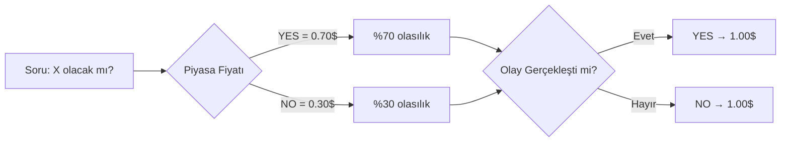
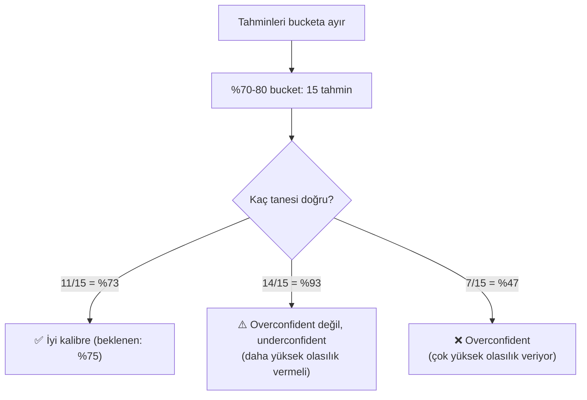
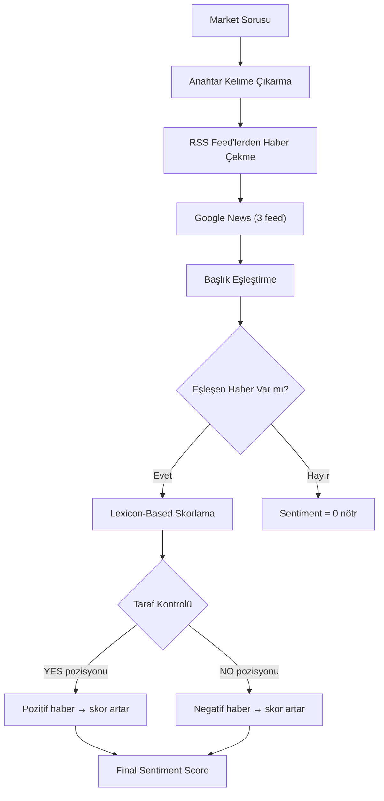
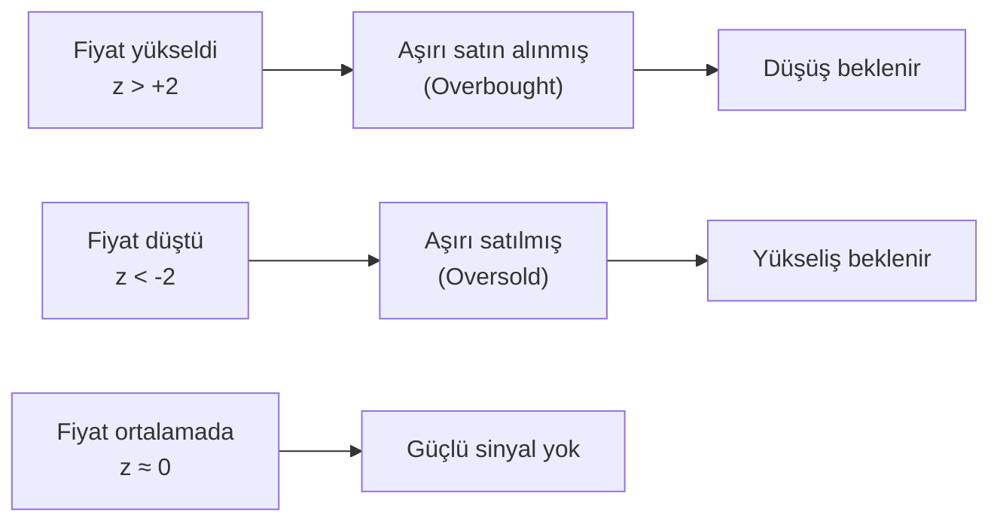
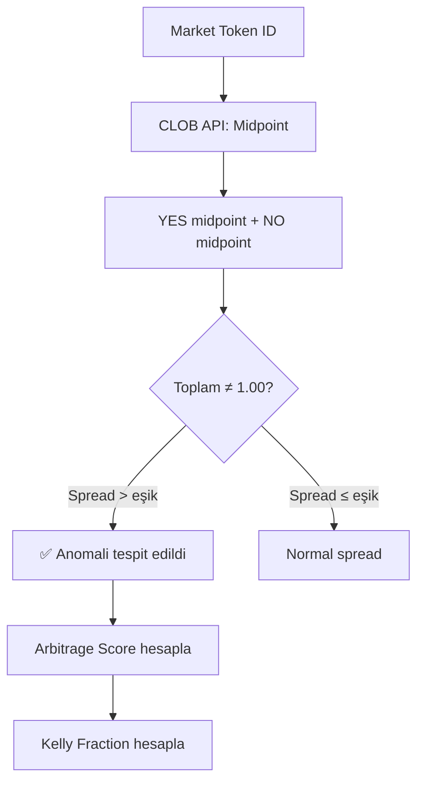
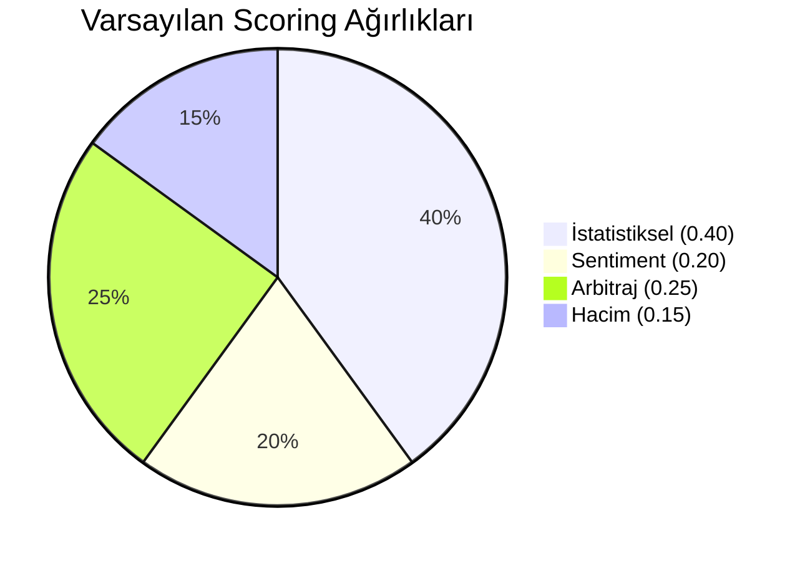
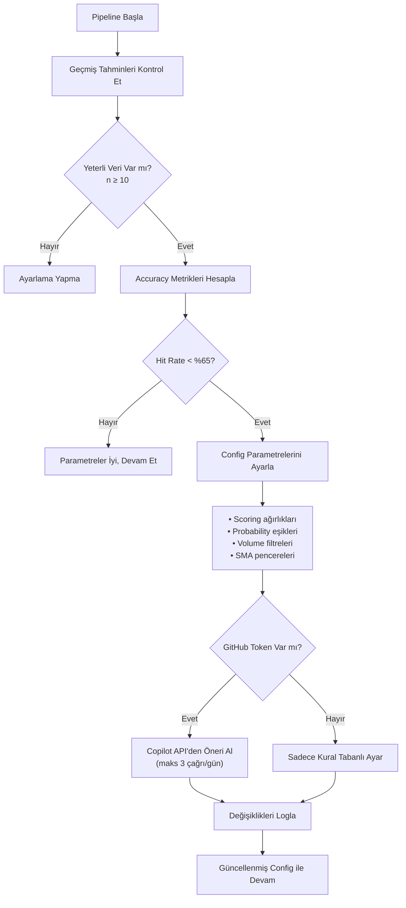
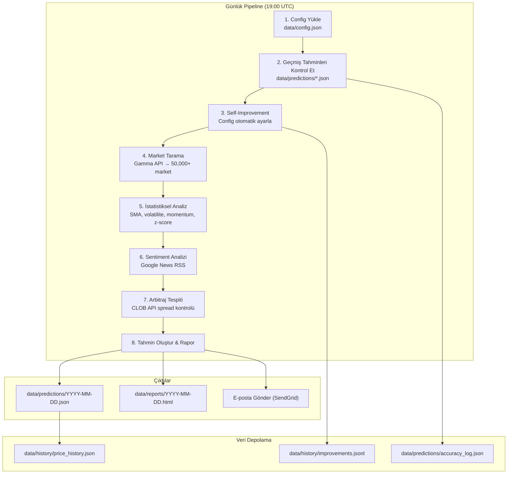
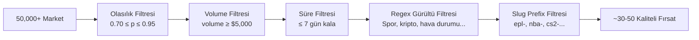

# Polymarket Tahmin Sistemi — Kavramlar ve Mimari

> Bu doküman, sistemde kullanılan tüm kavramları Türkçe olarak açıklar. Mermaid diyagramlarla desteklenmiştir.

---

## 1. Prediction Market (Tahmin Piyasası) Nedir?

Prediction market, gelecekte olacak olayların olasılığını belirlemek için kullanılan bir piyasa mekanizmasıdır. Katılımcılar bir olayın gerçekleşip gerçekleşmeyeceğine "YES" veya "NO" kontratları satın alarak bahis yapar.

**Temel prensipler:**
- Bir kontratın fiyatı 0-1 (veya 0%-100%) arasındadır
- Fiyat, piyasanın o olayın gerçekleşme olasılığına dair konsensüsünü yansıtır
- Olay gerçekleşirse YES kontratları 1.00$ olur, gerçekleşmezse 0.00$
- Fiyat ile gerçek olasılık arasındaki fark → **alım fırsatı**

**Polymarket** en büyük merkeziyetsiz tahmin piyasasıdır. API aracılığıyla tüm marketlere ve fiyat verilerine erişilebilir.

---

## 2. Kelly Criterion (Kelly Kriteri)

Kelly Criterion, bir bahiste optimal pozisyon büyüklüğünü belirleyen matematiksel formüldür. Amacı, uzun vadede portföy büyümesini maksimize etmektir.

### Formül

$$f^* = \frac{p \cdot b - q}{b}$$

Burada:
- $f^*$ = Sermayenin yüzde kaçının yatırılacağı (Kelly fraction)
- $p$ = Kazanma olasılığı (bizim tahminimiz)
- $q = 1 - p$ = Kaybetme olasılığı
- $b$ = Net oran (odds) = piyasa fiyatından hesaplanan oran

### Örnek
- Bizim tahmimiz: %80 olasılıkla YES
- Piyasa fiyatı: YES = 0.70$ (yani piyasa %70 diyor)
- $b = \frac{1}{0.70} - 1 = 0.4286$
- $f^* = \frac{0.80 \times 0.4286 - 0.20}{0.4286} = \frac{0.1429}{0.4286} = 0.333$
- **Yorum:** Sermayenin %33.3'ü bu fırsata ayrılmalı

**Dikkat:** Kelly fraction negatifse, bu pozisyona girmemek gerekir (edge yok).

Bizim sistemde Kelly fraction'ı **sinyal gücü** olarak kullanıyoruz — gerçekten bahis yapmıyoruz, ama yüksek Kelly = güçlü fırsat demek.

---

## 3. Brier Score (Brier Skoru)

Brier Score, olasılık tahminlerinin kalitesini ölçen bir metriktir. 0 (mükemmel) ile 1 (en kötü) arasında değer alır.

### Formül

$$BS = \frac{1}{N} \sum_{t=1}^{N} (f_t - o_t)^2$$

Burada:
- $f_t$ = t zamanındaki tahmin edilen olasılık
- $o_t$ = Gerçekleşen sonuç (1 = doğru, 0 = yanlış)
- $N$ = Toplam tahmin sayısı

### Yorum Tablosu

| Brier Score | Kalite |
|-------------|--------|
| 0.00 - 0.10 | Mükemmel |
| 0.10 - 0.20 | İyi |
| 0.20 - 0.30 | Orta |
| 0.30+ | Zayıf |

### Örnek
- Tahminimiz: %80 olasılıkla YES → f = 0.80
- Sonuç: YES gerçekleşti → o = 1
- $BS = (0.80 - 1.00)^2 = 0.04$ → Çok iyi!
- Tahminimiz: %80 olasılıkla YES ama NO gerçekleşti → o = 0
- $BS = (0.80 - 0.00)^2 = 0.64$ → Kötü tahmin

---

## 4. Kalibrasyon (Calibration)

Kalibrasyon, tahmin edilen olasılıkların gerçek sonuçlarla ne kadar uyumlu olduğunu ölçer.

**İdeal kalibrasyon:** "%70 dediğimde, gerçekten %70 oranında doğru çıkmalı."

**Overconfident:** Tahmin edilen olasılık, gerçekleşme oranından yüksek  
**Underconfident:** Tahmin edilen olasılık, gerçekleşme oranından düşük

Self-improvement modülümüz, kalibrasyon hatasını izleyerek otomatik düzeltme yapar.

---

## 5. Sentiment Analizi (Duygu Analizi)

Sentiment analizi, metin (haber başlıkları) üzerinden olumlu/olumsuz duygu tespiti yapar.

### Çalışma Prensibi

### Lexicon (Kelime Sözlüğü) Yaklaşımı
- **Pozitif kelimeler:** "approve", "pass", "win", "agree", "success", "increase" → +1
- **Negatif kelimeler:** "reject", "fail", "lose", "deny", "decrease", "block" → -1
- **Amplifier:** "very", "strongly", "significantly" → skoru 1.5x çarpar
- **Negation:** "not", "no", "never" → skoru tersine çevirir

### YES/NO Taraf Kontrolü
Kritik bir detay: Sentiment skoru, bahsin tarafına göre yorumlanır.
- Eğer **YES** pozisyonundaysak → pozitif haber bizi destekler
- Eğer **NO** pozisyonundaysak → negatif haber bizi destekler

---

## 6. Zaman Serisi Analizi

Market fiyat verilerini analiz etmek için kullandığımız istatistiksel göstergeler.

### 6.1 SMA (Simple Moving Average — Basit Hareketli Ortalama)

$$SMA_n = \frac{1}{n} \sum_{i=0}^{n-1} P_{t-i}$$

Son n günün fiyat ortalaması. Trend yönünü gösterir.
- Fiyat > SMA → Yukarı trend
- Fiyat < SMA → Aşağı trend

**Kullandığımız pencereler:** SMA-3 (kısa), SMA-7 (orta), SMA-14 (uzun)

### 6.2 Volatilite (Oynaklık)

$$\sigma = \sqrt{\frac{1}{n-1} \sum_{i=1}^{n} (r_i - \bar{r})^2}$$

Burada $r_i$ günlük getiri (fiyat değişim yüzdesi). Yüksek volatilite = fiyat çok oynuyor = daha riskli ama daha çok fırsat.

### 6.3 Momentum

$$M = P_t - P_{t-k}$$

Son k gündeki fiyat değişimi. Pozitif momentum = fiyat yükseliyor, negatif = düşüyor.

### 6.4 Z-Score

$$z = \frac{P_t - \mu}{\sigma}$$

Fiyatın ortalamadan kaç standart sapma uzakta olduğu.
- $|z| > 2$ → Fiyat uç noktada, mean reversion olasılığı yüksek
- $|z| < 0.5$ → Fiyat ortalamaya yakın, güçlü sinyal yok

---

## 7. Mean Reversion (Ortalamaya Dönüş)

Mean reversion, fiyatların uzun vadeli ortalamalarına dönme eğiliminde olduğunu söyleyen teori.

**Bizim kullanımımız:**
- z-score hesapla → aşırı yüksek/düşük fiyatlarda sinyal üret
- Mean reversion signal'i statistical score'a katkıda bulunur

---

## 8. Arbitraj ve Spread Anomali

### Spread Nedir?
Bir market'in YES ve NO kontratlarının midpoint fiyatları toplamı teorik olarak 1.00 olmalıdır.

$$\text{Spread} = |P_{YES} + P_{NO} - 1.00|$$

- Spread > 0 → arbitraj fırsatı (her iki tarafı da alıp risksiz kazanç)
- Gerçekte spread genellikle çok küçüktür (0.01-0.05)

### Anomali Tespiti
Spread belirli bir eşiğin üzerindeyse (config'de tanımlı), bu bir **spread anomali** olarak işaretlenir.

---

## 9. Composite Scoring (Bileşik Puanlama)

Her market fırsatı için 4 farklı sinyali ağırlıklı olarak birleştiriyoruz:

$$S_{composite} = w_1 \cdot S_{statistical} + w_2 \cdot S_{sentiment} + w_3 \cdot S_{arbitrage} + w_4 \cdot S_{volume}$$

| Sinyal | Açıklama | Ağırlık |
|--------|----------|---------|
| Statistical | SMA trend, momentum, z-score, mean reversion | 0.40 |
| Sentiment | RSS haber duygu skoru | 0.20 |
| Arbitrage | Spread anomali tespiti | 0.25 |
| Volume | İşlem hacmi normalize skoru | 0.15 |

Self-improvement modülü bu ağırlıkları otomatik olarak ayarlayabilir.

---

## 10. Self-Improvement (Kendini İyileştirme) Döngüsü

Sistem her çalıştığında, geçmiş tahminlerin doğruluğunu kontrol eder ve parametreleri otomatik ayarlar.

### Kural Tabanlı Ayarlar
1. **Kalibrasyon hatası > 0.20** → Sentiment ağırlığını düşür (en gürültülü sinyal)
2. **Hit rate çok düşük** → min_prob eşiğini yükselt (daha seçici ol)
3. **Çok fazla düşük kaliteli sinyal** → min_volume artır
4. **Hit rate çok yüksek** → min_prob eşiğini düşür (daha fazla fırsat bul)
5. **Brier score > 0.30** → Daha uzun SMA penceresi ekle (daha fazla smoothing)

---

## 11. Pipeline Akış Diyagramı

Tüm sistemin uçtan uca akışı:

---

## 12. Gürültü Filtreleme

Polymarket'te 50,000+ market bulunur. Bunların büyük çoğunluğu spor bahisleri, kripto fiyat tahminleri veya tweet sayacı gibi analiz değeri düşük marketlerdir. Filtre sistemi:

---

*Bu doküman, sistemin tüm kavramsal temellerini anlamak için hazırlanmıştır. Teknik implementasyon detayları için kaynak koduna bakınız.*

*Son güncelleme: 2026-03-31*
